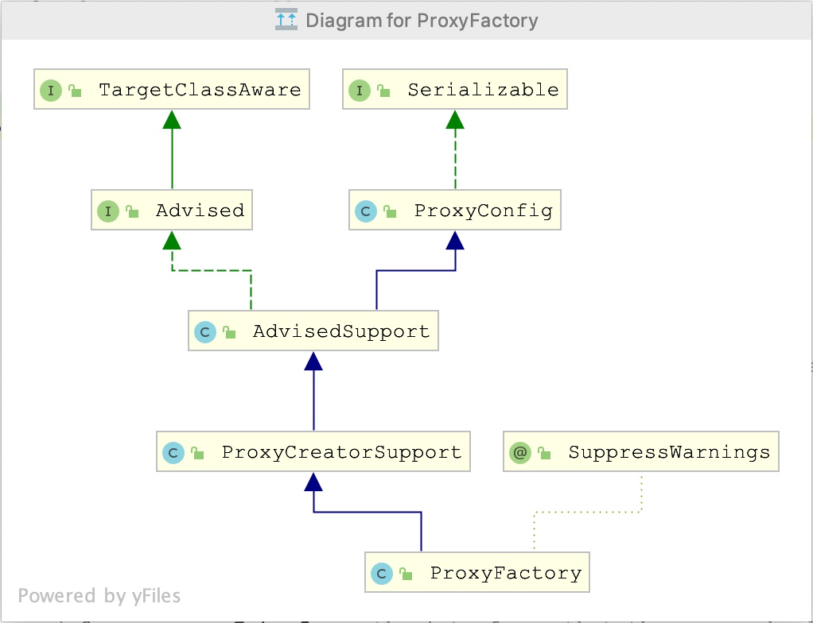
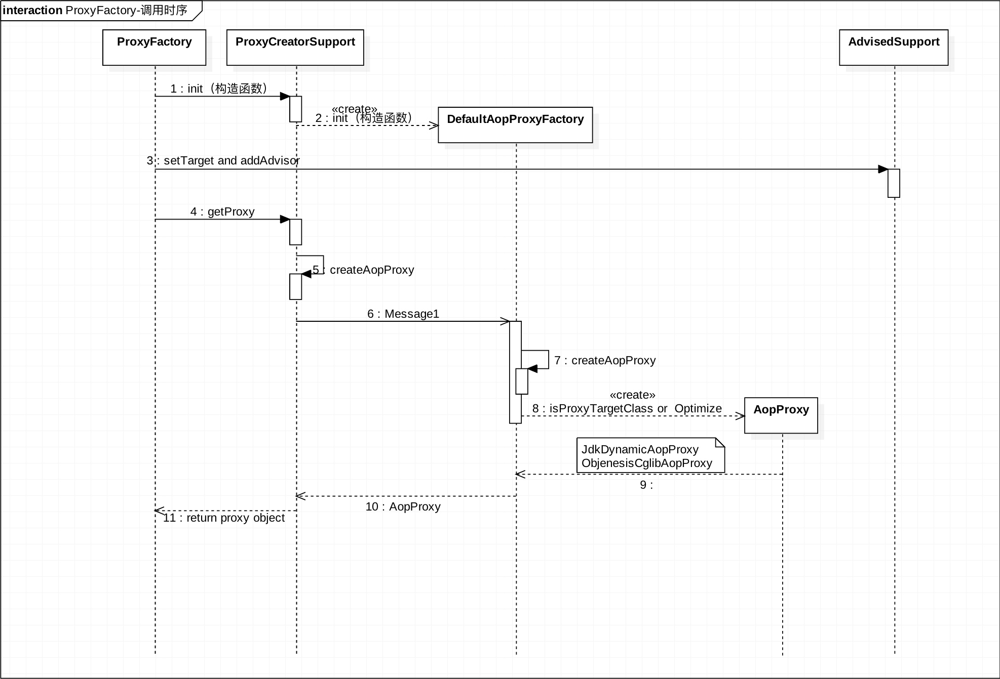

# Spring ProxyFactory 实现简单分析

使用 ProxyFactory 可以实现一个完整 AOP 逻辑。类图：

核心在 ProxyCreatorSupport 类，其中 aopProxyFactory 在构造函数中就进行了初始化，通过 `DefaultAopProxyFactory#createAopProxy(AdvisedSupport config)` 返回具体的 `AopProxy` 对象，主要有2个实现类：

* JdkDynamicAopProxy：JDK 自带的动态代理
* ObjenesisCglibAopProxy：CGLib 的动态代理

整个核心处理类如下：

* DefaultAopProxyFactory：工厂类，主要构件在什么条件下面使用 JDK 动态代理还是 CGLib 的代理
* AdvisedSupport：切面参数逻辑处理（配置）

具体时序图

时序图说明：
1. 构造函数初始化的时候构件好了工厂类 `AopProxyFactory` （实现类 `DefaultAopProxyFactory`）。
2. 调用 setTarget 和 addAdvisor 或者其他设置切面的方法时，其实是 `AdvisedSupport` 处理了业务逻辑。这里更多只是做配置。
3. 当 `getProxy` 的时候，`DefaultAopProxyFactory` 通过 `AdvisedSupport` 中的相关配置判断采用 JDK 或者 CGLib 的动态代理。构件完成具体的代理厂商的时候，在此调用 `AdvisedSupport` 中的数据进行目标代理对象的构建。

基础的使用可以看Github：https://github.com/JerryDai90/java-case/blob/master/spring/aop/src/main/java/fun/lsof/spring/aop/hardcode/SpringAopHardCodedByProxyFactoryTest.java

