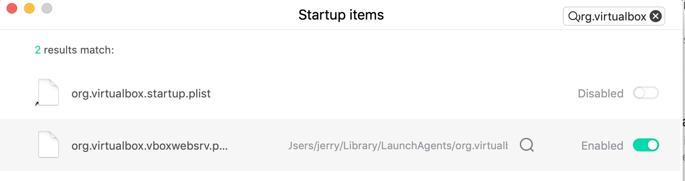

# 软件使用踩坑记录

## macos 出现 /dev/vboxnetctl: no such file or directory

　　刚刚安装完成的时候是可以启动的，但是一重启机器就仅主机网络就不通了。可以按这个解决办法解决 [https://www.iditect.com/how-to/54715315.html](https://www.iditect.com/how-to/54715315.html)，但是我还是不行。想着是否是由于 “柠檬清理” 把启动项禁止了，一查果然是  

　　
