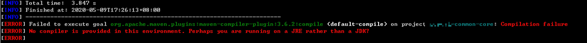

## 1. nginx 启动

　　使用 nginx 的时候，如果需要使用到80端口，一定需要使用root账号或者 sudo 启动，否则会有意想不到的问题。比如说，静态页面访问正常，普通接口也调用正常，但是文件上传却调用失败，后台页没有报错

## 2. mysql 的写入中文乱码

　　如果JDBC操作数据库的时候乱码，需要检查几个地方

* 数据库的字符集以及表的字符集（不同的字符集能够装载的字符不一样，建议去了解一下不同的字符集的范围）
* 查看JDBC 中 url 是否有指定编码与表和数据库一致（比如：useUnicode=true&characterEncoding=utf-8）

## 3. 安装 jdk-8u251-windows-x64.exe

　　安装完成后，使用 maven 编译工程，发现报错

　　

　　查看环境变量

```
C:\Program Files (x86)\Common Files\Oracle\Java\javapath;
```

　　却发现引入的是这个，java -version 命令也是正确的。修改为 真正的路径就可以了，如下图：

　　

> 难道这个为了兼容32位调用？
>

## 4. tomcat访问不了

　　在做配置nginx 的ssl的时候，发现静态页面可以访问（静态页面是挂载到nginx的目录下）。但是做了一个tomcat的映射访问不了（此tomcat已经启动。也没有报错）。发现使用ip访问 nginx 访问就是访问不了tomcat服务（但是通过域名有可以访问）。经过排查，发现有一个软件已经占用了端口，而域名可以访问可能是去到了其他集群（我已经设置hosts，把域名映射到127.0.0.1 上了）。折腾了2小时。

> 特此记录，发现应用访问不了，又没有爆出应用端口冲突。需要使用命令吧与此相关的端口都关掉后再试。
>

## 5. nginx 静态文件路径

　　由于再 window下使用的是 `\` 反斜杠，导致路径解析的时候如果出现如：

```
D:\xxxxx\txxx
```

　　这个时候里面的 \t 就认为是转义字符，导致路径访问不了问题。所以，在所有的windows的路径中，建议采用双反斜杠，就会认为是个路径，而不是转衣服就。

```
D:\\xxxxx\\txxx
```

　　[转义符说明-百度百科](https://baike.baidu.com/item/%E8%BD%AC%E4%B9%89%E5%AD%97%E7%AC%A6)

## 6. MQ读取到的消息是乱码

　　归根结底来说，所有的乱码都是字符集对应不上导致产生乱码。所以获取MQ body数据的时候需要转义一下与输入的字符集相同的编码。其他地方乱码也是一样道理。

　　//TODO
nginx 外网配置问题
结果是禁止了post请求。。

## 7. mysql function踩坑

* length 函数是字节长度，不是字符长度
* 如果concat中任何一个对象没有初始化值，此值不能被set

## 8. nginx 配置的静态页面地址后还是访问不了页面

　　配置完全正确的情况下，如果出现这个问题很大概率是由于静态页面所在的目录权限文件，nginx无法读取。这个大概率出现在别人发送的html或者在github下载的的html。因为这些页面默认携带了其他的授权，而nginx 无权限访问。只需要给里面的文件赋权即可。粗暴的凡是先直接赋予 777

　　
