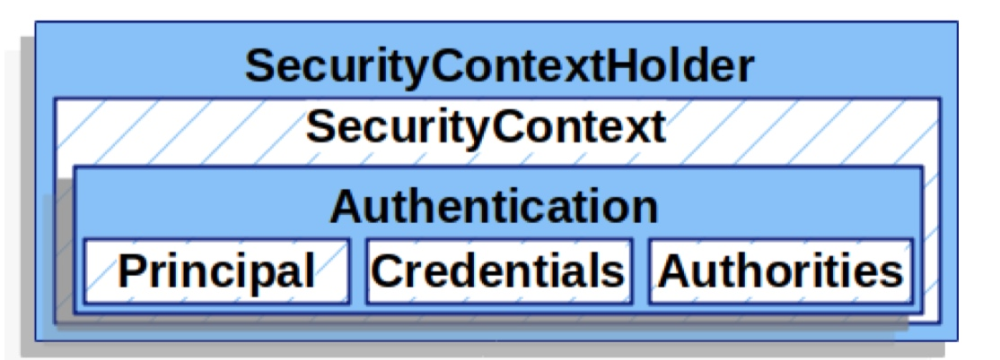

# Spring Security2 认证

#### 2.1.1 attemptAuthentication() 方法做了什么？

　　//TODO 如何构建到过滤器列表中的待分析，需要了解为什么这样设计。
//TODO 如何将UsernamePasswordAuthenticationFilter 放入到过滤器链中去
//TODO 写出 UsernamePasswordAuthenticationFilter 的处理过程。与实例化过程

　　如果没有 AD，默认行为SpringBootWebSecurityConfiguration

　　所有的类都会通过 AutowireBeanFactoryObjectPostProcessor.postProcess 进行处理，处理后好像就可以在过滤器中使用了？

　　自动装配了ObjectPostProcessorConfiguration bean，用于注入到spring 容器

　　巧妙通过 SharedObject 进行共享对象，然后通过接口定义找到具体的实现类

　　SecurityBuilder 是构建的基础

　　bean scop 作用域总结

　　分析 @EnableGlobalAuthentication 看认证管理器是如何生成的，AuthenticationManagerBuilder 容器生成的和流转中的对象是否是一个？

---

　　//TODO 哪里获取到了 所有的 Bean Filter对象
···

---

　　目前已经看到 DelegatingFilterProxy 是如何使用的了

---

　　proxyBeanMethods Full模式/Lite模式实现上的差异

　　FilterComparator 初始化了所有的过滤器，在HttpSecurity里面new，为什么要这样构建呢？

　　@EnableWebSecurity

　　这些类的用途
AuthenticationManagerBuilder

　　AbstractConfiguredSecurityBuilder

　　spring 事件机制

---

　　题目：做手机短信认证相关接口实现（基于Security）。支持账号认证。

　　存疑：

1. FilterChainProxy 中的 SecurityFilterChains filterChains 是哪里注入的？通过什么方式可以自定义自己前缀过滤器处理组
2. SecurityFilterChain 里面的 Filter 又是哪里组装进来的？
3. SecurityContextHolderStrategy的作用？
4. ExceptionTranslationFilter 是在哪里执行的？

　　SecurityContextHolder
用于构建认证的媒介，授权类型，授权信息等。


　　@Pre 和 @Post 注解
有四个注解支持表达式属性,以允许调用前和调用后的授权检查,还支持过滤提交的集合参数或返回值. 它们是 @PreAuthorize,@PreFilter,@PostAuthorize 和 @PostFilter. 通过 global-method-security 命名空间元素启用它们的使用:

* Spring Boot

```java
@EnableGlobalMethodSecurity(prePostEnabled = true)
```

* xml

```xml
<global-method-security pre-post-annotations="enabled"/>
```
